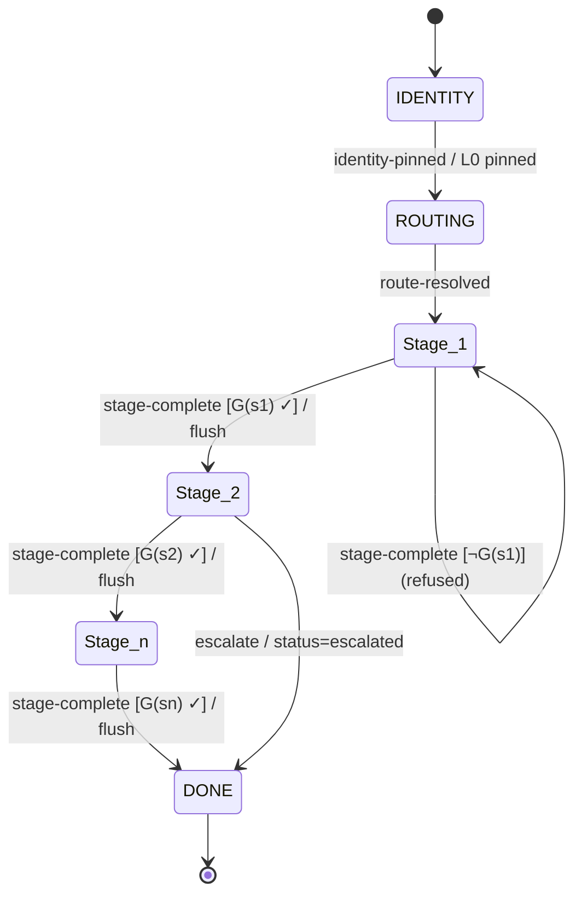

# Animus Dark Matter — Local Intelligence Multiplier (LIM): Formal Specification

**Status:** Draft v0 (sprint s0 — formalization). Runtime implementation is
scheduled for s1; empirical validation for s2. This document is normative for
the framework's *design*; §10 tracks what is deferred.

**Contents**

- [0. Abstract & the Dark Matter Thesis](#0-abstract--the-dark-matter-thesis)
- [1. Provenance (summary)](#1-provenance-summary)
- [2. Definitions, Notation & Glossary](#2-definitions-notation--glossary)
- [3. The Layer Model — a Capability Lattice](#3-the-layer-model--a-capability-lattice)
- [4. The ICM State Machine](#4-the-icm-state-machine)
- [5. Invariants](#5-invariants)
- [6. The MCP Knowledge Layer](#6-the-mcp-knowledge-layer)
- [7. The Enforcement Model](#7-the-enforcement-model)
- [8. Canonical Directory Layout](#8-canonical-directory-layout)
- [9. Validation Design — Measuring the Multiplier](#9-validation-design--measuring-the-multiplier)
- [10. Roadmap & Open Questions](#10-roadmap--open-questions)

---

## 0. Abstract & the Dark Matter Thesis

### 0.1 What this is

**Animus Dark Matter** is a framework for making a *small, local* language model
reason far above its weight class by moving two burdens — **domain-knowledge
recall** and **multi-step state-tracking** — out of the model's parameters and
out of its active context window, and into an external structure the model never
holds in full at any one moment:

- a **filesystem state machine** (the *Interpretable Context Methodology*, ICM)
  that physically partitions the workflow into isolated stages, and
- an **MCP knowledge vault** (a stdio *Model Context Protocol* server) that
  serves clean, text-only reference chunks on demand.

The framework's promised effect is the **Local Intelligence Multiplier (LIM)**:
structure multiplies effective capability.

### 0.2 The thesis, stated precisely

Let `cap_T(M, S)` denote the capability (e.g. task success rate) of a model `M`
on a task class `T` when supported by an external structure `S`, with `S = ∅`
meaning the model works alone. Let `M_small` be a 7–8B local model, `M_frontier`
a large hosted model, and `S_DM` the Dark Matter structure. Let `T*` be the
framework's **target task class**: knowledge-intensive, multi-step tasks in which
retrieval and state-tracking — not raw parametric cleverness — dominate the
difficulty (e.g. "implement feature X against library Y's current API," carried
across research → plan → code → verify).

> **Thesis (LIM).** On `T*`,
>
> &nbsp;&nbsp;&nbsp;&nbsp;`cap_T*(M_small, S_DM)  ≫  cap_T*(M_small, ∅)`,
>
> and, more ambitiously,
>
> &nbsp;&nbsp;&nbsp;&nbsp;`cap_T*(M_small, S_DM)  →  cap_T*(M_frontier, ∅)`.
>
> That is: the structure closes most of the small-vs-frontier gap on `T*`.

Define the **multiplier**

&nbsp;&nbsp;&nbsp;&nbsp;`μ  :=  cap_T*(M_small, S_DM) / cap_T*(M_small, ∅)  >  1`&nbsp;&nbsp;(ideally `≫ 1`).

The thesis is an empirical claim, not an axiom. §9 specifies the experiment that
would confirm or **falsify** it; this document's job is to make the framework
precise enough for that experiment to be meaningful.

### 0.3 Mechanism

The multiplier is claimed to arise from a single lever — **keeping the active
context `C_active` minimal and pristine at every step** — applied structurally:

1. **Knowledge is offloaded** to L3 and delivered in small, exact chunks via MCP
   (§6), so `C_active` never carries a library's whole documentation, only the
   fragment the current step needs.
2. **State is offloaded** to the filesystem: the stage FSM (§4) tracks *where we
   are*, and L4 artifacts (§3) carry *what we have produced*, so the model need
   not hold the whole plan in context.
3. **Isolation** (one active stage; §4, §5) prevents the model from having to
   reconcile intent-parsing, doc-fetching, and code-generation in a single
   inference — the failure mode small models are worst at.

The model's scarce parametric and context budget is thus spent on **reasoning**,
not recall or bookkeeping. The framework's wager is that recall+bookkeeping is
most of what separates `M_small` from `M_frontier` on `T*`.

### 0.4 Why "Dark Matter" — the name is the thesis

In cosmology, galaxies rotate faster than their *visible* (luminous) mass can
explain; the discrepancy implies a large reservoir of **unseen mass** whose
gravity shapes the motion of everything visible. You never observe dark matter
directly — only its effect on the luminous matter's trajectory.

Map this onto the framework:

| Cosmology | Animus Dark Matter |
|---|---|
| Luminous (baryonic) matter | The model's weights **+** its active context window `C_active` — everything "lit up" in a single inference |
| Dark matter | The filesystem ICM **+** MCP vault — the overwhelming majority of the system's effective information/control "mass," never fully lit in any one inference |
| Gravity shaping visible motion | The **harness** (§7) gating what enters `C_active`, shaping the model's reasoning trajectory step by step |
| Rotation curve faster than luminous mass predicts | A small model performing on `T*` **better than its luminous (parametric) mass predicts** |

The rotation-curve anomaly is the whole point: capability-versus-parameter-count
is *flatter* than expected because unseen **structural mass** is doing the work.
That flattening is the **multiplier**. (The analogy is a naming intuition, not a
physical claim; §9 is where it earns its keep.)

---

## 1. Provenance (summary)

Dark Matter is an **adaptation**, and says so plainly. Its five-layer design is
closely derived from the **Model Workspace Protocol (MWP)** introduced in
*"Interpretable Context Methodology: Folder Structure as Agentic Architecture"*
(Van Clief & McDermott, arXiv:2603.16021). DM's layers L0–L4 map almost
one-to-one onto MWP's layers. Full credit, citations, and a departure table live
in [`PROVENANCE.md`](./PROVENANCE.md); the essentials:

**What DM inherits from ICM/MWP:** folder-structure-as-agent-architecture; the
five-layer identity/routing/stages/reference/artifacts split; numbered stage
folders; stage contracts expressed as Inputs·Process·Outputs; the principle that
the human-inspectable filesystem *is* the control surface.

**What DM changes (its reason to exist):**

1. **Target.** MWP was demonstrated on a frontier model (Claude Opus 4.6). DM
   re-targets **small local models** (Llama-3-8B, Qwen-2.5-7B) — the setting
   where structure must substitute for raw capability.
2. **A hard MCP knowledge gate.** MWP reads L3 reference files directly. DM makes
   L3 reachable **only** through a stdio MCP server (§6), which becomes the
   enforcement point for context isolation.
3. **A formal model.** The ICM paper explicitly *"lacks rigorous state-machine
   notation."* DM supplies it: an FSM over stages × a capability lattice over
   layers, with checkable invariants (§4, §5).
4. **External enforcement.** MWP relies on a capable model largely respecting the
   structure. DM assumes an *un*reliable small model and moves enforcement
   **out** of the model into a harness (§7).
5. **A falsifiable validation design** for the multiplier claim (§9).

---

## 2. Definitions, Notation & Glossary

### 2.1 Notation

| Symbol | Meaning |
|---|---|
| `M`, `M_small`, `M_frontier` | A model; a 7–8B local model; a large hosted model |
| `T`, `T*` | A task class; the framework's target task class (knowledge- and state-heavy, multi-step) |
| `S`, `S_DM`, `∅` | An external support structure; the Dark Matter structure; no structure (model alone) |
| `cap_T(M, S)` | Capability (e.g. success rate) of `M` on `T` under support `S` |
| `μ` | The multiplier, `cap_T*(M_small, S_DM) / cap_T*(M_small, ∅)` |
| `C_active` | The active context window presented to `M` at one inference step |
| `L0 … L4` | The five layers (§3) |
| `Σ`, `σ`, `δ`, `G` | ICM state set; a state; transition function; transition guards (§4) |
| `INV-k` | Invariant number `k` (§5) |

### 2.2 Glossary

- **LIM (Local Intelligence Multiplier).** The framework's goal and claimed
  effect: an external structure multiplies a small local model's effective
  capability on `T*`. The framework is sometimes referred to by this name.
- **ICM (Interpretable Context Methodology).** Folder-structure-as-agent-
  architecture. In DM, formalized as an FSM over **stages** × a **capability
  lattice** over **layers** (§4).
- **MWP (Model Workspace Protocol).** The concrete protocol from the ICM paper
  (arXiv:2603.16021) that DM adapts. See §1, `PROVENANCE.md`.
- **Layer (L0–L4).** A horizontal band of the structure with a fixed capability
  profile: L0 identity, L1 routing, L2 stages, L3 reference, L4 artifacts (§3).
- **Stage.** A unit of work living in L2. Exactly one stage is *active* at any
  time. The FSM's non-meta states are stages (§4).
- **Capability lattice.** The partial order over `{read, fetch, write}`
  capabilities across layers that constrains what the active state may touch
  (§3). The orthogonal axis to the stage FSM.
- **Hard gate.** An access boundary enforced **externally** (by the harness or
  the MCP server), not by model self-discipline. Specifically: L3 reference
  content is reachable *only* via MCP fetch (§6), never by direct read.
- **Parametric saturation.** Degradation of a model's reasoning when its weights
  and/or context are overloaded with recalled knowledge and bookkeeping. DM's
  design goal is to avoid it by offloading both (§0.3).
- **Multiplier (`μ`).** The capability ratio defined in §0.2 and §2.1.
- **Context minimality.** The property that `C_active` contains only what the
  active state needs: pinned L0 + the active stage contract + explicitly fetched
  L3 chunks + referenced L4 artifacts — nothing else (INV-5, §5).
- **Harness.** The external executor that drives `M`, runs the state machine,
  enforces the lattice and invariants, and mediates **all** of the model's I/O
  (§7). In the metaphor, the harness is "gravity."
- **Artifact.** A file written to L4 by a stage — the only runtime-writable
  state and the sole medium of inter-stage communication (§3, INV-4).
- **Routing matrix.** The L1 mapping from a problem signature to an ordered
  **stage sequence** plus, per stage, the L3 reference bindings that stage is
  allowed to fetch (§3, §6).
- **Stage contract.** The L2 `(Inputs, Process, Outputs)` specification of a
  stage. Its **Outputs** clause is the transition guard `G` for leaving that
  stage (§4).

---

## 3. The Layer Model — a Capability Lattice

The framework has **two orthogonal axes**. This section defines the first: the
**layer** axis — *what the model is allowed to touch* — as a capability lattice.
The second, the **stage** axis — *where in the workflow the model is* — is the
state machine of §4. At any instant the model's permitted operations are the
**intersection** of the two: the active stage (§4) scopes down the capabilities
the layer lattice grants.

### 3.1 Primitive capabilities and per-layer profiles

There are three primitive capabilities, `P = {READ, FETCH, WRITE}`:

- **READ** — a harness-mediated direct read of a file's text into `C_active`.
- **FETCH** — retrieval of a reference chunk through the MCP server (§6). This is
  the **only** channel by which L3 content may enter `C_active`.
- **WRITE** — creation or modification of a file.

Each layer carries a fixed capability profile:

| Layer | Directory | Role | Read | MCP-Fetch | Write | Runtime-mutable | Pinned in `C_active` |
|-------|-----------|------|:----:|:---------:|:-----:|:---------------:|:--------------------:|
| **L0** | `00_identity/` | System identity & execution constraints | ✓ (pinned) | ✗ | ✗ | no (immutable) | **yes** |
| **L1** | `01_routing/` | Routing matrix (problem → stages + ref bindings) | ✓ | ✗ | ✗ | no (immutable) | no |
| **L2** | `02_stages/` | Stage contracts (Inputs·Process·Outputs) | ✓ (active stage only) | ✗ | ✗ | no (immutable) | active contract only |
| **L3** | `03_reference/` | Knowledge vault (mirrored clean-markdown) | ✗ (gated) | ✓ **MCP-fetch only** | ✗ | no (stable) | no (fetched chunks only) |
| **L4** | `04_artifacts/` | Working artifacts / scratchpad | ✓ (referenced) | ✗ | ✓ **(the only writable layer)** | **yes** | referenced artifacts only |

Two rows carry the load-bearing asymmetries: **L4 is the only layer with WRITE**,
and **L3 is the only layer reached by FETCH and it permits no direct READ** — its
access mode is *MCP-fetch only*. Everything else is immutable, read-only support.

### 3.2 The lattice

Order the powerset `2^P` by subset inclusion `⊆`. `(2^P, ⊆)` is a Boolean
lattice (meet = `∩`, join = `∪`); each layer is assigned one element of it:

```
L0 → {READ}     L1 → {READ}     L2 → {READ}
L3 → {FETCH}    L4 → {READ, WRITE}
```

This is the **capability lattice**. It is the same construction as Denning's
lattice model of secure information flow (Denning, 1976): layers are security
classes, and permitted operations are ordered by the lattice. The model's
*effective* capability at any step is bounded above by the join of the layers the
active stage admits, and the **harness enforces that bound** (§7). The design
consequence is that WRITE is confined to a single class (L4) while knowledge
flows *in* through a narrow, audited channel (L3 via FETCH) that cannot
contaminate identity, routing, or reference state.

### 3.3 Scope refinement

Capability is more precisely a `(verb, scope)` pair: the lattice fixes the *verb*;
the active stage (§4) and routing matrix (§6) fix the *scope*.

| Layer | Verb | Scope (set by the active stage / routing matrix) |
|-------|------|--------------------------------------------------|
| L0 | READ | all of L0, **pinned** for the whole run |
| L1 | READ | the routing matrix; consulted in `ROUTING` and on each transition |
| L2 | READ | **only** the active stage's `CONTRACT.md` (never a sibling stage's) |
| L3 | FETCH | **only** the reference bindings the routing matrix bound to the active stage — no ambient/global fetch |
| L4 | READ / WRITE | READ: prior artifacts named in the active stage's `Inputs`; WRITE: **only** the active stage's own output area |

### 3.4 Why this yields the mechanism of §0.3

- **WRITE confined to L4** → all mutable state is localized and auditable; the
  model cannot corrupt its own identity, routing, or knowledge. *(Formalized as
  INV-2, §5.)*
- **L3 FETCH-only** → knowledge enters as small, exact chunks instead of whole
  documents, which is the core of context minimality. *(INV-3, §5.)*
- **L2 read scoped to the active stage** → the model never sees sibling stages'
  internals, so it cannot conflate jobs. *(INV-4, §5.)*
- **L0 pinned & immutable** → stable constraints without re-reading, spending no
  per-step context budget on identity.

Together these keep `C_active` minimal and pristine, which §0.3 identifies as the
lever behind the multiplier `μ`.

## 4. The ICM State Machine

The **stage** axis (the second of the two axes from §3) is a finite state
machine. Where the source ICM paper *"lacks rigorous state-machine notation,"*
this section supplies it.

### 4.1 The machine as a tuple

The ICM is the tuple

&nbsp;&nbsp;&nbsp;&nbsp;`ICM = (Σ, σ₀, F, Δ, G, flush)`

- **`Σ`** — the finite **state set** (§4.2).
- **`σ₀ = IDENTITY`** — the initial state.
- **`F = {DONE}`** — the terminal (accepting) states. `DONE` carries a status in
  `{complete, escalated}` (§4.5); adding no extra control states keeps the model
  small.
- **`Δ ⊆ Σ × Event × Σ`** — the guarded **transition relation** (§4.4).
- **`G`** — the family of **guard predicates** (§4.4).
- **`flush`** — the **context-flush** applied on every transition (§4.6).

At any instant exactly one state `σ ∈ Σ` is active (INV-1, §5).

### 4.2 States `Σ`

`Σ = {IDENTITY, ROUTING} ∪ {s₁, …, sₙ} ∪ {DONE}`, where:

- **`IDENTITY`** — bootstrap. The harness loads L0 and **pins** it into
  `C_active` for the entire run.
- **`ROUTING`** — the harness reads the L1 routing matrix, computes a problem
  signature for the task, and resolves an **ordered stage sequence**
  `⟨s₁, …, sₙ⟩` together with each stage's L3 **reference bindings**.
- **`s₁ … sₙ`** — the **stages**, drawn from `02_stages/` and ordered by ROUTING.
  Each `sᵢ` has a contract `(Inputs, Process, Outputs)` (§2.2).
- **`DONE`** — terminal.

### 4.3 Configuration

The harness tracks a **configuration** `κ = (σ, C_active, A)`: the control state
`σ`, the ephemeral active context `C_active`, and the persistent artifact set
`A ⊆ L4` produced so far. Transitions change `σ`, may extend `A`, and always
reset `C_active` (§4.6). `A` is the durable "data state"; `C_active` is working
memory; `σ` is the program counter.

### 4.4 Transition relation `Δ` and guards `G`

Transitions are driven by **events the model proposes and the harness validates**
(§7). The principal event is **`stage-complete`**. The guard on leaving a stage
is the stage's own Outputs contract:

> **`G(sᵢ)` holds** ⟺ every artifact named in `sᵢ.Outputs` exists in L4 and is
> well-formed.

| From | Event | Guard | To |
|------|-------|-------|-----|
| `IDENTITY` | `identity-pinned` | L0 loaded & pinned | `ROUTING` |
| `ROUTING` | `route-resolved` | a non-empty stage sequence `⟨s₁…sₙ⟩` was resolved | `s₁` |
| `sᵢ` (`i<n`) | `stage-complete` | **`G(sᵢ)`** — `sᵢ.Outputs` satisfied | `sᵢ₊₁` |
| `sₙ` | `stage-complete` | **`G(sₙ)`** | `DONE` |
| `sᵢ` | `stage-complete` | **¬`G(sᵢ)`** | `sᵢ` (refused — stay; finish outputs) |
| `sᵢ` | `escalate` | guard unmet after the harness's bounded-retry budget | `DONE` (status `escalated`) |

Guards are checked by the **harness**, never self-reported by the model (§7).
A refused transition leaves the machine in `sᵢ`; the model continues producing
the missing outputs.

### 4.5 Failure & escalation

The framework does not silently loop. If `G(sᵢ)` cannot be met within the
harness's bounded-retry budget, the machine transitions to `DONE` with status
`escalated`, surfacing the stuck stage for human diagnosis rather than inventing
progress. (Retry budget and escalation policy are harness configuration, §7.)

### 4.6 Context-flush-on-transition

On **every** transition `σ → σ′`, the harness applies `flush`:

1. Clear `C_active` **except** the pinned L0 identity.
2. Load `σ′`'s required context and nothing more: for a stage `s′`, that is
   `s′.CONTRACT.md` (L2, scoped to `s′` only), the artifacts named in
   `s′.Inputs` (read from L4), and the **availability** of `s′`'s L3 reference
   bindings — fetchable on demand via MCP (§6), **not** preloaded.

`flush` is the physical mechanism behind context minimality (INV-5) and stage
isolation (INV-4): each stage begins from a clean slate plus pinned identity, so
the model *cannot* carry intent-parsing, doc-fetching, and code-generation into a
single overloaded prompt cycle — the exact failure mode small models handle worst
(§0.3).

### 4.7 State diagram



`Stage_1 … Stage_n` denote the routing-resolved stages `s₁ … sₙ`; the diagram's
states are exactly `Σ` (§4.2): `IDENTITY`, `ROUTING`, the stages, and `DONE`.

## 5. Invariants

A conforming implementation must uphold the following six invariants. Each is
stated as a **mechanically checkable condition**: an observer with access to the
harness's logs (the control state, the write log, the MCP-fetch log, and the
provenance-partition of `C_active`) can decide *pass* or *fail* without judgment.
The harness enforces them at runtime (§7); `scripts/verify-spec.sh` checks that
the spec itself references them consistently.

Notation: `active()` is the current stage; `scope(s)` is stage `s`'s permitted
`(verb, path)` set (§3.3); `prov(x)` is the provenance of a fragment `x` in
`C_active`.

### INV-1 — Single Active Stage
**Statement.** At every execution step, exactly one state `σ ∈ Σ` is active.
**Condition.** `|{σ ∈ Σ : active(σ)}| = 1`.
**Check.** Inspect the harness configuration `κ` (§4.3); two concurrently active
stages, or none between transitions, is a violation.
**Enforced by.** The FSM control state (§4) + harness (§7).

### INV-2 — Write-Isolation to L4
**Statement.** Every write performed on the model's behalf lands in
`04_artifacts/`, within the active stage's output area — never in L0–L3.
**Condition.** For every write event `w`: `path(w) ∈ L4  ∧  (WRITE, path(w)) ∈ scope(active())`.
**Check.** Audit the write log; any write whose path is outside L4 (or outside
the active stage's output area) is a violation.
**Enforced by.** The capability lattice (§3, L4 = the only `WRITE` class) +
harness write-validation (§7).

### INV-3 — L3 Reference Gate
**Statement.** L3 content enters `C_active` **only** through an MCP fetch (§6);
the model has no direct-read path to `03_reference/`.
**Condition.** For every reference fragment `r` in `C_active`:
`prov(r) = MCP-fetch  ∧  r ∈ bindings(active())`.
**Check.** No `03_reference/` path appears in the model's direct-read log; every
L3 fragment in context is traceable to an MCP-fetch call bound to the active
stage.
**Enforced by.** The MCP server as sole L3 gatekeeper (§6) + harness (§7).

### INV-4 — Stage Isolation
**Statement.** While `sᵢ` is active, the only readable L2 contract is
`sᵢ.CONTRACT.md`; sibling stages' contracts and scratch never enter `C_active`.
Inter-stage communication is solely via L4 artifacts.
**Condition.** `C_active ∩ L2 ⊆ {sᵢ.CONTRACT.md}`, and any information originating
in `sⱼ` (`j ≠ i`) present in `C_active` arrived via an L4 artifact.
**Check.** Scan `C_active` for foreign contract content; scan artifact
provenance for the only sanctioned cross-stage channel (L4).
**Enforced by.** L2 read-scoping (§3.3) + context-flush-on-transition (§4.6).

### INV-5 — Context Minimality
**Statement.** `C_active` contains only the four sanctioned sources and nothing
else.
**Condition.**
`C_active ⊆ pinned(L0) ∪ {active contract} ∪ fetched(L3 chunks) ∪ referenced(L4 artifacts)`,
and the residual (unaccounted) partition is empty.
**Check.** Partition `C_active` by provenance into the four buckets; a non-empty
residual bucket is a violation.
**Enforced by.** `flush` on every transition (§4.6) + harness context assembly
(§7). This is the invariant most directly responsible for the multiplier `μ`.

### INV-6 — Routing Determinism
**Statement.** For a fixed routing matrix and a fixed problem signature, `ROUTING`
resolves the same stage sequence and reference bindings on every run.
**Condition.** `route` is a pure function:
`route(matrix, signature) = ⟨s₁…sₙ⟩ + bindings`, and equal inputs yield equal
outputs.
**Check.** Re-run `ROUTING` with identical inputs; any difference in the resolved
sequence or bindings is a violation (routing is auditable and reproducible).
**Enforced by.** A deterministic routing matrix (§3, L1) + harness (§7).

## 6. The MCP Knowledge Layer

L3 (`03_reference/`) is served by a stdio **Model Context Protocol** server. This
section pins the contract to the current protocol (2026-07-28 spec RC): stdio
transport (the harness spawns the server as a subprocess; newline-delimited
JSON-RPC over stdin/stdout), and the three primitives **Resource** (read-only
data), **Tool** (executable action), **Prompt** (template). DM uses **Resources +
exactly one Tool**.

### 6.1 Reference chunks are Resources — not a Tool payload

Each mirrored document is pre-chunked into clean-markdown fragments; **each chunk
is an MCP Resource** with a stable URI:

&nbsp;&nbsp;&nbsp;&nbsp;`ref://{target}/{doc-path}#{chunk-id}`

- Resources are **read-only**, matching L3's immutable, fetch-only profile (§3).
- Enumerated via `resources/list`, read via `resources/read`.
- Every read result carries **`ttlMs`** and **`cacheScope`** (SEP-2549): because
  reference content is stable and non-user-specific, `cacheScope` is **shared**
  (safe to cache across runs and users) and `ttlMs` is sized to the mirror's
  refresh cadence. Repeated reads of the same chunk are served from cache —
  **zero marginal context tokens** — which is what makes the README's "near-zero
  token bloat / pristine context window" claim actually true. Only the exact
  chunk, never the whole document, ever enters `C_active`.

> **Design note (ADR-0002).** The README specified the knowledge layer as a Tool
> (`fetch_isolated_context`). Static, addressable, cacheable reference data is
> idiomatically a **Resource**; modelling chunks as Resources is what unlocks
> `ttlMs`/`cacheScope`. The Tool is retained only for *search* (§6.2).

### 6.2 One Tool: `fetch_isolated_context` (search / routing)

When the exact chunk URI is not known a priori, a single Tool resolves it:

- **Input:** `{ target: string, query?: string, section?: string, k?: int = 4 }`
  — `target` is a reference corpus **bound to the active stage** by the routing
  matrix; `query` is a semantic/keyword search; `section` selects an explicit
  heading; `k` caps the number of chunks returned.
- **Output:** `{ chunks: [{ uri: "ref://…", text: string, score: number }], truncated: bool }`
  — up to `k` clean-markdown chunks, each with its `ref://` URI (so the caller
  can cite or re-`resources/read` it and hit cache) and a relevance score.
  Text-only; never HTML.

So: **Resources are the addressable back-end; the one Tool is the search
front-end.** That is the entire public surface of the knowledge layer.

### 6.3 The server is the sole L3 gatekeeper

The MCP server is the **only** process with filesystem access to
`03_reference/`. The harness and model reach L3 **exclusively** through
`resources/read` or `fetch_isolated_context` — there is no direct-read code path.
This realizes **INV-3** structurally rather than by instruction: the gate is
missing-by-construction, not merely forbidden. The server serves a chunk only if
its `target` is in the **active stage's reference bindings** (passed by the
harness); an out-of-binding or ambient fetch is refused, upholding
`r ∈ bindings(active())` from INV-3 (§5).

### 6.4 Isolation & caching guarantees (summary)

- **Text-only:** chunks are pre-cleaned markdown, so no markup tokens reach
  `C_active`.
- **Cacheable:** `ttlMs`/`cacheScope` make repeat reads cost zero marginal
  context.
- **Scoped:** per-stage bindings keep the model from wandering the whole vault.

### 6.5 The ingestion pipeline — *out of scope for s0* (contract only)

The producer of L3 Resources is a component named **`mirror`**. It is **deferred
to s1**; only its contract is fixed here so §6's Resources have a defined source:

- **Input:** a target descriptor `{ source_url | local_path, selector? }`.
- **Process:** fetch → strip to clean markdown (drop HTML/chrome) → chunk by
  heading/size → assign `ref://{target}/…#{chunk}` URIs → build a search index.
- **Output:** a set of addressable, searchable Resources under
  `03_reference/{target}/`, consumable by §6.1–6.2.

Implementation of `mirror` (and the server itself) is s1 (§10).

## 7. The Enforcement Model

### 7.1 The principle: "physically cannot," not "must not"

The README asks the model to *"only read/write files matching its current
directory layer."* A 7–8B local model will not reliably obey such an instruction —
and a framework whose isolation depends on the model's discipline has no
isolation at all. DM therefore moves enforcement **out of the model** and into an
external **harness**. The design principle is that the model *cannot* misbehave
because the surrounding structure physically constrains its inputs and outputs —
enforcement by **construction**, not by instruction.

### 7.2 The harness

The **harness** is the external process that drives the local model. It is the
executor of the state machine (§4) and the owner of everything the model is not
trusted with:

1. It **holds the configuration** `κ = (σ, C_active, A)` (§4.3) — the single
   source of truth for control state. The model never mutates `κ` directly.
2. It **assembles `C_active`** for each step to satisfy INV-5: pinned L0 + the
   active stage's contract + fetched L3 chunks + referenced L4 artifacts, and
   nothing else. **The model only ever sees what the harness assembles.**
3. It **exposes a constrained action interface** (§7.3) — the sole things the
   model can *do*.
4. It **validates every proposed action** against the invariants before applying
   it.
5. It **runs `δ` with guard `G`** (§4.4); the model cannot self-transition.

### 7.3 The model as a constrained function

The model is reduced to a pure proposer, `propose : C_active → Action`, where the
**action alphabet is exactly three**:

- **`WRITE(path, content)`** — the harness validates `path`. If `path` is not in
  L4 within the active stage's output area, the **write is rejected** (INV-2);
  otherwise it is applied and extends the artifact set `A`.
- **`FETCH(target, query | uri)`** — routed to the MCP server, which serves a
  chunk only if `target` is in the active stage's bindings (INV-3), returning it
  into `C_active`. **There is no "read arbitrary file" action**, so L3 direct
  reads are impossible by absence.
- **`STAGE_COMPLETE`** — the harness evaluates `G(active())` (Outputs satisfied,
  §4.4). If it holds, `δ` advances and `flush` runs (§4.6); if not, the signal is
  **refused** and the model is told which outputs are still missing.

Crucially, there is **no** action for "switch stage," "read a sibling stage's
contract," or "read L3 directly." The capability lattice (§3) *is* this action
interface: capabilities the lattice withholds simply have no corresponding verb
the model can invoke.

### 7.4 Enforcement mapping (actions ↔ invariants)

| Invariant | How the harness enforces it |
|-----------|-----------------------------|
| **INV-1** Single active stage | Harness holds one `σ`; no "switch stage" action exists — only guarded `δ`. |
| **INV-2** Write-isolation to L4 | `WRITE` validated to `L4 ∩ scope(active())`; out-of-scope writes rejected. |
| **INV-3** L3 reference gate | Only `FETCH` reaches L3, via the MCP server, which checks bindings; no direct-read verb exists. |
| **INV-4** Stage isolation | `C_active` assembly excludes sibling contracts; `flush` clears on transition (§4.6). |
| **INV-5** Context minimality | Harness assembles `C_active` from exactly the four sanctioned sources. |
| **INV-6** Routing determinism | Harness computes the route deterministically in `ROUTING`; the model does not route. |

Every `INV-n` named here is defined in §5.

### 7.5 Trust boundary

The model is **untrusted for control and access** and trusted only to *propose
content*. The harness and MCP server form the **trusted computing base**. This
inverts the README's implicit "capable, well-behaved model" assumption, and has
one decisive consequence:

> **Isolation correctness does not depend on model capability.** A weaker model
> is *less capable*, never *less safe*. Safety is decoupled from capability —
> which is precisely what makes targeting small local models viable.

### 7.6 Scope of the harness

The harness does **no reasoning** — it is a strict, "dumb" executor. All
intelligence is the model's; all *control* is the harness's. Retry budget and the
escalation policy (§4.5) are harness configuration. DM's harness is a specific
instance of the general agent-harness pattern, distinguished by enforcing the
FSM × capability-lattice and the MCP reference gate as its invariants.

## 8. Canonical Directory Layout

_The canonical on-disk layout (`00_identity/ … 04_artifacts/`) that the
`template/` scaffold instantiates._

<!-- populated by T-007 -->

## 9. Validation Design — Measuring the Multiplier

_A falsifiable experiment for the multiplier: experimental arms (M_small alone,
M_small+DM, M_frontier ceiling), metrics (success rate, tokens-in-context/step,
invariant-violation count), a task set over `T*`, and explicit pass/falsify
criteria._

<!-- populated by T-007 -->

## 10. Roadmap & Open Questions

_What is deferred and to which sprint (s1 runtime, s2 validation), plus the open
design questions this spec does not yet close._

<!-- populated by T-007 -->
